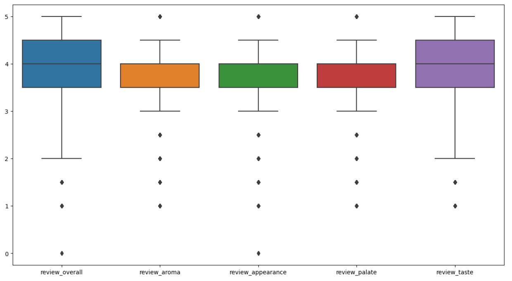
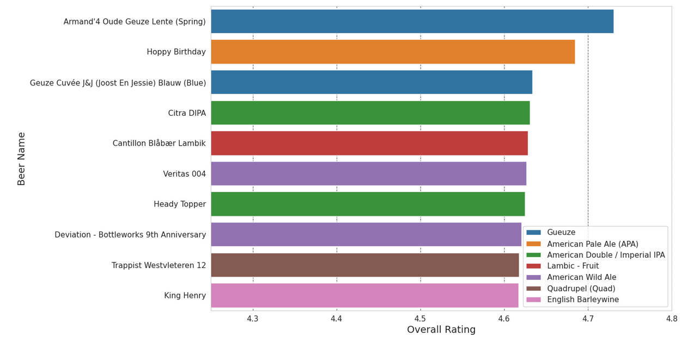
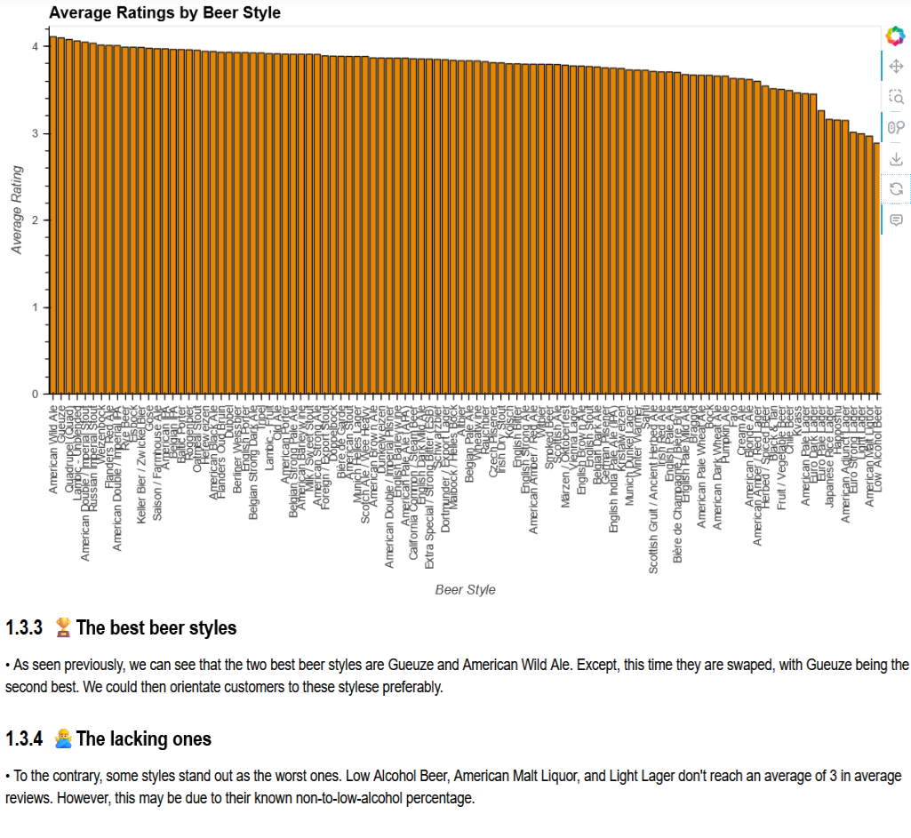
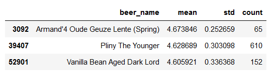
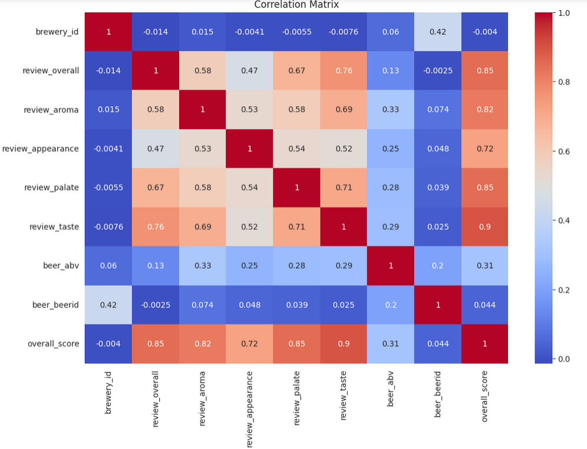

# beer_reviews

🍺 The Ultimate Beer Review Notebook 🍻

    Author: Clément Cipriani
    Date: 14 June 2023
    Dataset: https://www.kaggle.com/datasets/rdoume/beerreviews

👋 Introduction

Welcome to the ultimate beer review notebook! 🎉🍻 A comprehensive data analysis tool for beer enthusiasts and connoisseurs. Uncover valuable trends and patterns in beer reviews, explore flavor profiles, and make data-driven decisions with this powerful notebook. Elevate your beer tasting experience with data-backed insights.

Cheers to informed sipping! 🍺🍺

# Data Exploration

We will see in this analysis how beer reviews are spread between 5 indicatiors: overall, aroma, taste, appearance, and palate. Each kind having grade for each beer.

# Data Analysis

Thus, we will be able to decipher from these reviews the best beers as from BeerAdvocates' users.

This will allow us to go deeper and analysis why these beers make it to the top, based on the other features present in the dataset.

Then, we will be able to do so for some unique kinds of beers, such as the weirdest ones, the ones lacking, the most polarizing ones etc. To then focus on what are the very best ones based on the reviews, the count of reviews, and the standard deviation of reviews.

We will then be able to form analysis based on this information, but I will let you discover it in the notebook!
Finally, we will look at what consitutes a good beer, and why is that, through a correlation matrix.

